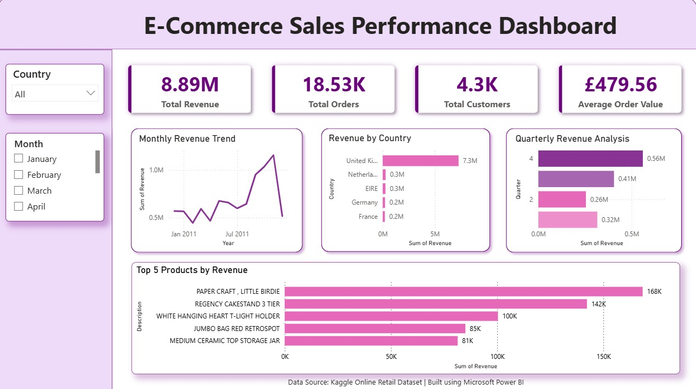

# 📊 E-Commerce Sales Performance Analytics

### Future Interns – Data Science & Analytics Internship (Task 1)

---

## Project Overview

This project was completed as part of the **Future Interns Data Science & Analytics Internship – Task 1: Business Sales Performance Analytics**.

The objective was to analyze e-commerce transaction data and deliver a business-ready analytics solution that provides actionable insights into sales performance, customer behavior, product trends, and regional revenue distribution.

The project combines **Python-based data analysis** with **Power BI dashboard development** to support data-driven decision-making for business stakeholders.

---

## Business Problem

E-commerce businesses generate large volumes of transactional data daily. Without proper analysis, valuable insights related to customer purchasing behavior, product performance, seasonal demand, and revenue trends remain hidden.

This project addresses the following key business questions:

* How is revenue performing over time?
* Which products generate the highest revenue?
* Which countries contribute most to sales?
* What seasonal trends exist within the business?
* How can business performance be improved using data-driven insights?

---

## Dataset

**Source:** Kaggle Online Retail Dataset

https://www.kaggle.com/datasets/ulrikthygepedersen/online-retail-dataset

The dataset contains online retail transactions recorded between **December 2010 and December 2011**.

### Key Attributes

| Column      | Description            |
| ----------- | ---------------------- |
| InvoiceNo   | Transaction Identifier |
| Description | Product Description    |
| Quantity    | Units Purchased        |
| UnitPrice   | Product Price          |
| CustomerID  | Customer Identifier    |
| Country     | Customer Country       |
| InvoiceDate | Transaction Timestamp  |

---

## Data Preparation

The dataset was cleaned and transformed using Python to ensure accuracy and consistency before analysis.

### Processing Steps

* Removed missing records
* Handled duplicate entries
* Created Revenue metric
* Extracted Month, Quarter, and Year features
* Prepared analytical dataset for dashboard visualization

---

## Dashboard KPIs

| KPI                 | Value   |
| ------------------- | ------- |
| Total Revenue       | £8.89M  |
| Total Orders        | 18.53K  |
| Total Customers     | 4.3K    |
| Average Order Value | £479.56 |

---

## Dashboard Features

### Interactive Filters

* Country Filter
* Month Filter

### Visualizations

* Monthly Revenue Trend
* Revenue by Country
* Quarterly Revenue Analysis
* Top 5 Products by Revenue

---

## Dashboard Preview





---

## Key Business Insights

### Revenue Trends

* Generated approximately **£8.89 million** in total revenue.
* Revenue peaked during **November 2011**, indicating strong seasonal demand.
* Quarterly analysis highlights stronger performance during Q4.

### Geographic Performance

* The **United Kingdom contributed nearly 82% of total revenue**.
* Other significant markets include:

  * Netherlands
  * Germany
  * France
  * Ireland

### Product Performance

Top revenue-generating products:

1. PAPER CRAFT, LITTLE BIRDIE
2. REGENCY CAKESTAND 3 TIER
3. WHITE HANGING HEART T-LIGHT HOLDER

### Customer Analysis

* Over **4,300 unique customers** contributed to sales.
* Revenue is concentrated among a relatively small group of high-value customers.
* Customer purchasing patterns indicate opportunities for retention and loyalty initiatives.

---

## Business Recommendations

### Expand International Presence

Reduce dependency on the UK market by increasing marketing efforts in high-performing European regions.

### Improve Customer Retention

Develop loyalty programs and personalized campaigns for high-value customers.

### Optimize Product Strategy

Prioritize inventory planning and promotional campaigns for top-performing products.

### Leverage Seasonal Demand

Prepare inventory and marketing activities ahead of peak sales periods, particularly during Q4.

---

## Technology Stack

* Python
* Pandas
* NumPy
* Matplotlib
* Jupyter Notebook
* Microsoft Power BI
* GitHub

---

## Repository Structure

```text
FUTURE_DS_01
│
├── Dashboard
│   └── Ecommerce_Sales_Dashboard.pbix
│
├── Dataset
│   └── DATASET_INFO.md (Dataset information & access link)
│
├── Images
│   └── dashboard_image.png
│
├── Notebooks
│   └── sales_analysis.ipynb
│
├── Reports
│   └── Ecommerce_Sales_Analytics_Report.pdf
│
└── README.md
```

---

## Deliverables

✅ Exploratory Data Analysis Notebook

✅ Interactive Power BI Dashboard

✅ Business Analytics Report

✅ Business Insights & Recommendations

✅ GitHub Repository Documentation

---

## Project Outcome

The project transformed raw transactional data into a business intelligence solution that supports strategic decision-making through interactive reporting and actionable insights.

By combining Python-based data preparation with Power BI visualization, the analysis identified revenue drivers, customer trends, top-performing products, and geographic sales patterns, enabling data-driven recommendations for business growth.

The final solution is suitable for presentation to:

* Business Owners
* Startup Founders
* Analytics Clients
* Decision Makers

---

## Author

**Sravya Rachuri**

Future Interns – Data Science & Analytics Internship

**Task 1: Business Sales Performance Analytics**
